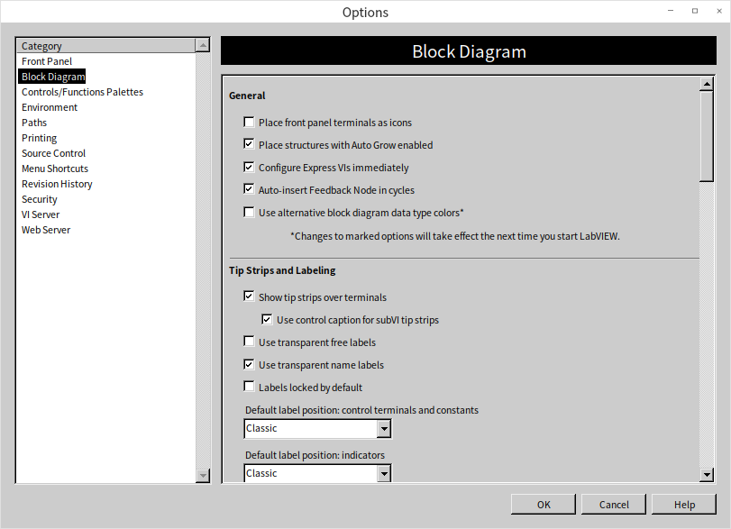
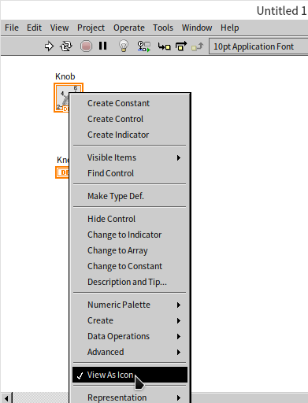

# Customizing the Programming Environment

LabVIEW's default settings might not always align with your preferences or needs. Fortunately, the LabVIEW programming environment is highly customizable, allowing you to tailor it for enhanced programming efficiency.

## Environment Options

To explore and adjust the settings, navigate to "Tools -> Options" in the LabVIEW menu. This action will bring up the LabVIEW options dialog box:

This dialog box contains a multitude of configurable options. For detailed explanations of each setting, the "Help" button on the dialog box can be a valuable resource.

### Personalizing Your Experience

It’s important to note that these settings are subjective; there is no one-size-fits-all approach. LabVIEW programmers are encouraged to experiment with different configurations to find what best suits their personal style and workflow. For instance, I prefers to modify the display mode of the control terminals on the block diagram. There are two display modes available for control terminals on the block diagram: icon mode and non-icon mode. While icon mode is more visually appealing and intuitive, it occupies more space. On the other hand, non-icon mode conserves screen real estate by reducing the size of the terminals:

Preferences like these can be set in the options dialog box. Additionally, as discussed in the [Local Variables and Properties](data_and_controls#mplementing-blinking-controls-for-alerts) section, settings such as the blinking frequency of a control are also configurable here. Some advanced functions can be enabled through this dialog, which will be covered in later chapters.

### Configuration File

LabVIEW stores these settings in a configuration file. On Windows, this file is typically the LabVIEW.ini file located in the same folder as LabVIEW.exe. Once you are familiar with the format of this configuration file, you can even modify settings directly in the file. The process of editing such configuration files will be explored in the [File I/O](pattern_file) section.

## Optimizing the Function and Control Palettes

The function and control palettes are integral to programming in LabVIEW, and their configuration can significantly impact your programming efficiency. The settings for both palettes are similar, so for brevity, we will focus on the function palette as an example to demonstrate customization options.

### Utilizing Floating Windows

For functions that are used frequently, one efficient method is to transform the function palette into a floating window. This is done by clicking the "thumbtack" icon on the palette. In its floating window state, the palette remains visible above all VI windows, providing easy and immediate access to frequently used functions. However, it's worth noting that the floating window can obscure part of the program code. When certain functions are not in regular use, you might prefer to hide the palette to free up screen space. It can be quickly accessed again by right-clicking on a blank area of the block diagram, which brings up the function palette.

### Customizing the Default Palette Layout

By default, when the function palette is activated, particularly with the right mouse button, it may displays only one expanded category, with others minimized or even hidden:

Depending on your project or personal preference, the functions you frequently use may not be in the default expanded category. Fortunately, LabVIEW allows you to customize the layout of the palette and set your default visible items: 

- If accessing the palette via the right mouse button, first pin it into a floating window by clicking the thumbtack button in the upper left corner.
- Click the "Customize" button on the floating function palette window.
- In the "Change Visible Palettes" dialog box, select the categories you use most often. These selected items will then appear by default on the function palette.
- Conversely, you can remove categories that are seldom used to streamline the palette and expedite the selection of more commonly used functions:

By default, the function palette in LabVIEW expands the topmost item. Therefore, placing your most frequently used items at the top can enhance your programming efficiency.

### Adjusting the Position of Items

To reposition an item within the function palette, hover your mouse over the two vertical lines to the left of the desired item (e.g., "Favorites"). The cursor will change to a cross with arrows, indicating that you can drag the item. Click and hold the mouse button to drag the "Favorites" item to the top of the function palette. Once released, the "Favorites" category will be the first expanded item you see:

### Customizing the "Favorites" Category

The rationale behind moving "Favorites" to the top is its customizable nature, allowing users to easily add their most frequently used functions. For instance, if you want to add the "Programming -> Structure" category to "Favorites", follow these steps:

1. Click on the "Programming" category to expand it.
2. Click on the "Structure" subpalette to expand it.
3. Right-click on the "Structure" label of the subpalette, select "Add Subpalette to Favorites".

Following these steps will ensure that the "Structure" subpalette is readily accessible under "Favorites" in future sessions:

After adding several frequently used categories to "Favorites", the function palette's layout becomes significantly more user-friendly. In future programming sessions, the commonly used sub-categories will be displayed immediately upon opening the function palette, streamlining the programming process:

## Searching Functions and Controls

LabVIEW offers an extensive array of functions and controls, which can sometimes be overwhelming when you're trying to locate a specific feature. To streamline this process, LabVIEW provides a search function within its function palette.

### Searching in Palettes

To access the search, click the "Search" button (marked with a magnifying glass icon) at the top of the function or control palette:

In the search dailog, input your keywords, then drag and drop the desired result directly onto your VI's block diagram or front panel. Alternatively, double-clicking a search result navigates you to its location on the palette, helping you learn where specific nodes are typically found for future reference.

### Quick Drop

LabVIEW also features a tool known as Quick Drop, activated by the shortcut "Ctrl+Space". Note that this shortcut may conflict with system shortcuts for switching input methods, particularly in systems with Chinese language support. If you encounter issues with this shortcut, alternatives like "Ctrl+Shift+Space" or "Alt+Space" can be tried. On some systems, including the mine, "Ctrl+Alt+Space" activates Quick Drop.

Quick Drop not only searches for functions and controls but also allows you to create custom shortcuts:

### Configuring Shortcuts in Quick Drop

You can view and edit shortcut configurations in Quick Drop by clicking the Configure button. LabVIEW has a default set of shortcuts, but custom shortcuts can be added for more frequently used functions or controls:

For instance, if you frequently use the "Expression Node", you can assign a simple letter, such as "e", as a shortcut for it. Afterward, typing "e" in Quick Drop and pressing Enter will immediately place an Expression Node on your diagram:

These search tools and customizable shortcuts significantly enhance the efficiency of programming in LabVIEW, making it easier to navigate the comprehensive suite of functions and controls available.

## Tool Palette

In the graphical programming environment of LabVIEW, the mouse plays a multifaceted and more significant role compared to text-based programming languages. It is used for a variety of actions, such as selecting, dragging, resizing objects, wiring, inserting breakpoints, and probes. Essentially, the mouse serves multiple purposes, adapting to different tasks within the LabVIEW interface.

### Automatic Tool Selection

By default, LabVIEW is configured to automatically select the mouse function based on its position and context. Based on personal experience, the "Automatic Tool Selection" option is sufficient for handling most programming tasks in LabVIEW. It conveniently adjusts the mouse function based on the cursor's context within the VI. For instance, when the cursor is moved over a function, the mouse adapts to allow dragging of the function. Similarly, when positioned at a function’s terminal, it switches to wiring mode. While this automatic selection feature is generally convenient, it also has its downsides. It requires precise cursor placement to activate the desired functionality, which can be time-consuming and sometimes frustrating.

### Manual Tool Selection

For programmers who prefer more control over their tools, manually changing the mouse function can be more efficient. This eliminates the need for precise cursor placement, as the desired tool can be selected in advance.

This manual selection is facilitated through the "Tool Palette". Accessing this board can be done in two ways:
1. Navigate to "View -> Tool Palette" in the menu.
2. Press and hold the Shift key and right-click in a blank area of the front panel or block diagram.

At the top of the tool Palette is the "Automatic Tool Selection" button, symbolized by a wrench and screwdriver icon. When engaged, LabVIEW will automatically select the mouse function. Clicking this button again turns off the automatic tool selection, switching to manual tool mode where the user selects the desired mouse function.

Clicking on the appropriate button on the tool Palette allows you to switch the mouse to that specific function. Alternatively, you can use keyboard shortcuts for rapid switching between different mouse functions.

On the **block diagram** window:
- Press the **space bar** to toggle the mouse function between "Wiring" and "Positioning/Adjusting Size/Selection".
- Press the **Tab key** to cycle the mouse through four functions: "Operate Value", "Positioning/Adjusting Size/Selection", "Edit Text", and "Wiring".

On the **front panel**:
- Press the **space bar** to switch the mouse between "Operate Value" and "Positioning/Adjusting Size/Selection".
- Press the **Tab key** to toggle the mouse among four functions: "Operate Value", "Positioning/Adjusting Size/Selection", "Edit Text", and "Set Color".

During **VI debugging**:
- Press either the **space bar** or the **Tab key** to switch the mouse among three functions: "Operate Value", "Set/Clear Breakpoint", and "Probe".

## Practice Exercise

- Take some time to thoroughly explore all the function palettes available in LabVIEW. This exercise involves reviewing each palette to identify functions that you might use in future projects. As you navigate through these palettes, pay attention to the arrangement and accessibility of the functions. Consider if the current order of the palettes aligns with your workflow or if rearranging them could enhance your programming efficiency. 